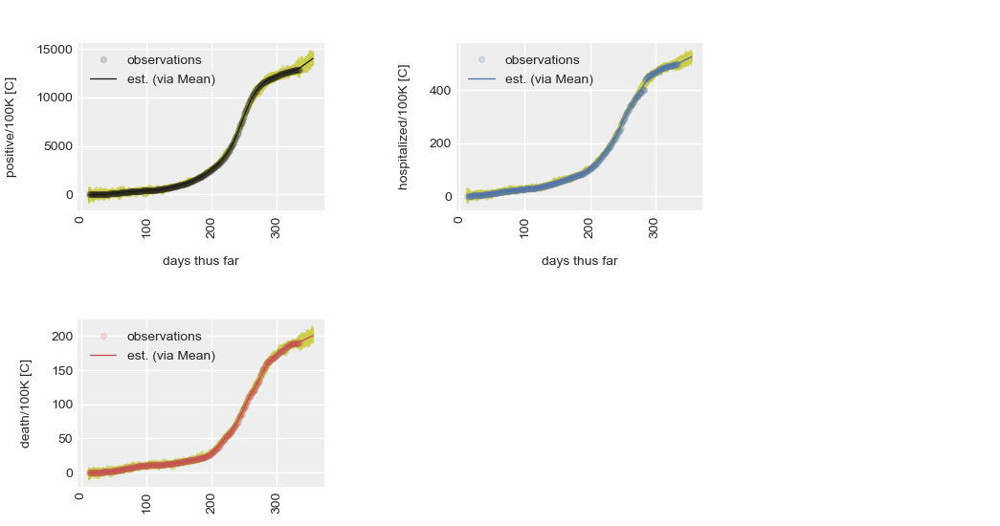

branch|state
:---|:---
develop|
master|

<br>
<br>

### SARS

The **focus** herein is the modelling or forecasting of SARS-CoV-2 related trends, and risks, via Bayesian 
modelling.  Both PyMC3 and TensorFlow Probability (TFP) are being explored.  The advantage of the latter is performance.

<br>
<br>

#### An Example



**This diagram** illustrates the preliminary results of a trends modelling investigation.  A stochastic model wherein the 
observed measures, i.e.,  the accumulative series of

* positive cases per 100K 

* hospitalised patients per 100K

* deaths per 100K

are set as **co-varying dependent variables**.  The term **per 100K** means **per 100K of the population of an area in question**.  The independent 
variable is days thus far.  The model predicts 21 days ahead, therefore the curves of observations are shorter than the curves of estimates; more 
details are continuously outlined in 
a [notebook](https://colab.research.google.com/github/plausibilities/sars/blob/develop/notebooks/inpatients/capita.ipynb), and its supplementary programs.

In a deployed mode, we'd aim to

* run the model daily.

* replace the x-axis values **days thus far** with **dates**.

* continuously compare model predictions with real values; therefore require curves of predictions & percentage errors, at least.

* use an interactive graphs, e.g., Tableau, HighCharts, D3, etc.

<br>
<br>

#### Notebooks & Programs

[Notebooks](./notebooks):

The notebooks are intentionally light.  The approach → light notebooks, and supplementary programs written in-line 
with the best practices of a development team, therefore minimising or eliminating the prototyping-deployment 
transition effort.  A helpful tool for this is the excellent GitHub Actions.  GitHub Actions simplifies software 
workflow automation and continuous integration & delivery.

The programs of this project, all located within directory [sars](./sars), are subject to the inspection 
settings outlined in the GitHub Actions file [main.yml](.github/workflow/main.yml).  Hence, each time a program 
is committed GitHub Actions performs inspections w.r.t. the settings of [main.yml](.github/workflow/main.yml) 

* capita.ipynb <br> [](https://colab.research.google.com/github/plausibilities/sars/blob/develop/notebooks/inpatients/capita.ipynb)

* natural.ipynb <br> [](https://colab.research.google.com/github/plausibilities/sars/blob/develop/notebooks/inpatients/natural.ipynb)

<br>
<br>
<br>


### Development Notes

#### Environment

The environment

```
conda create --prefix ~/Anaconda3/envs/uncertainty
```

The installations are

```bash
conda install -c anaconda pymc3 # installs: python, theano, arviz, numpy, pandas
conda install -c anaconda seaborn # installs: matplotlib
conda install -c anaconda python-graphviz # installs: graphviz
conda install -c anaconda pywin32 jupyterlab nodejs # installs: requests, urllib3
pip install dotmap


# For norms & testing
conda install -c anaconda pytest coverage pylint pytest-cov

# Upgrading PyMC3
pip install --upgrade pymc3==3.9.3

```

#### Requirements

For project *sars*

```bash
conda activate uncertainty
pip freeze -r docs/filter.txt > requirements.txt
```

and

```bash
pylint --generate-rcfile > .pylintrc
```
